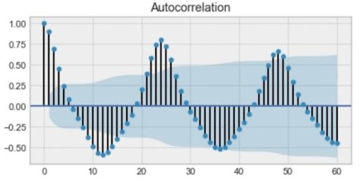
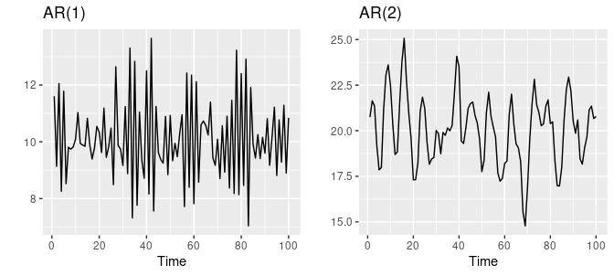
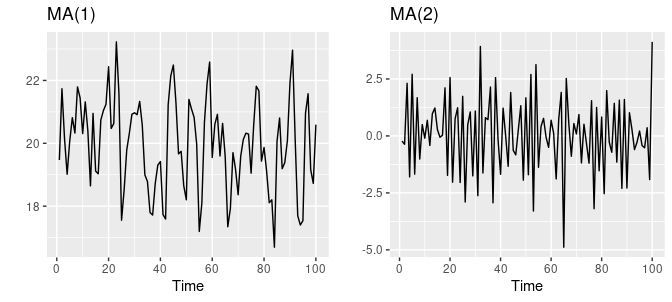

# Time Series Forecasting Methods

## Introduction

Time series forecasting is a technique for the prediction of events through a sequence of time. It predicts future events by analyzing the trends of the data in the past, on the assumption that future trends will hold similar to historical trends. Many prediction problems involve a time component and thus require extrapolation of time series data, or time series forecasting. It's widely used across many fields such as business planning, pattern recognition, signal processing, weather forecasting, econometrics, mathematical finance, etc. 

Time series forecasting is also an important area of machine learning and can be cast as a supervised learning problem. ML methods like `Regression`, `Neural Networks`, `Support Vector Machines`, `Random Forests`, and `XGBoost` - can be applied to it. 

## Some Terminologies

When dealing with time series data, there are some specific terminologies we need to understand:

* **Autocorrelation:** describes the relationship among values of the same data series at different time periods. The formula could be written as:

$$
\begin{aligned}
r_k=\frac{\sum_{t=k+1}^n\left(y_t-\bar{y}\right)\left(y_{t-k}-\bar{y}\right)}{\sum_{t=1}^n\left(y_t-\bar{y}\right)^2}
\end{aligned}
$$

where $r_k$ is the autocorrelation for lag $k$.

For example, we can see from the figure below that the 12th and 36th observations are highly correlated. 

* **Partial Autocorrelation:** a statistical measure that captures the correlation between two variables after controlling for the effects of other variables. For example, if we're regressing a signal $S_t$ with the same signal at lags $t-1, t-2, t-3(S_{t-1}, S_{t-2}, S_{t-3})$, the partial correlation between $S_t$ and $S_{t-3}$ is the amount of correlation between $S_t$ and $S_{t-3}$ that isn't explained by their mutual correlations with $S_{t-1}$ and $S_{t-2}$.

* **Seasonality:** fluctuations in the pattern due to seasonal determinants over a period such as a day, week, month, or season. Can also be derived from an autocorrelation plot if it has a sinusoidal shape.

* **Trend:** increase or decrease in the series of data over longer period.

* **Random or irregular variations:** instability due to random factors that do not repeat in the pattern.

* **Stationarity:** a time series is said to be stationary if its statistical properties don't change over time. In other words, it has a constant mean and variance, and its covariance is independent of time. [Dickey-Fuller](https://www.statsmodels.org/dev/generated/statsmodels.tsa.stattools.adfuller.html) method can be used to test stationarity. 

## Types of Time Series Model

There are many ways to model a time series in order to make predictions. The most popular ways include:

* Exponential Smoothing (ES)
* Autoregressive (AR)
* Moving Average (MA)
* Autoregressive Moving Average (ARMA)
* Autoregressive Integrated Moving Average (ARIMA)
* Seasonal Autoregressive Integrated Moving Average (SARIMA)
* Vector Autoregressive (VAR)
* Vector Error Correction (VEC)
* LSTM, XGBoost, N-Beats, Prophet, DeepAR, Temporal Fusion Transformer(Google), etc

### Exponential Smoothing Model

#### Simple Exponential Smoothing (SES)

This Simple Exponential Smoothing method is suitable for forecasting data with no clear trends or seasonalities. The forecasting formula of Simple ES could be written as:

$$
\begin{aligned}
\hat{y}_{T+1 \mid T}=\alpha y_T+\alpha(1-\alpha) y_{T-1}+\alpha(1-\alpha)^2 y_{T-2}+\cdots
\end{aligned}
$$

where $0 \leq \alpha \leq 1$ is the smoothing parameter. The idea behind ES is that the one-step-ahead forecast for time T+1 is a weighted average of all of the observations in the series $y_1, y_2, ..., y_T$. The rate at which the weights decrease is controlled by the parameter $\alpha$.

If $\alpha$ is small, more weights will be given to observations from the more distant past. If $\alpha$ is large, more weights will be given to more recent observations.

 #### Weighted Average Form

The forecast at time $T+1$ is equal to a weighted average between the most recent observation $y_T$ and the previous forecast $\hat{y}_{T|T-1}$:

$$
\begin{aligned}
\hat{y}_{T+1 \mid T}=\alpha y_T+(1-\alpha) \hat{y}_{T \mid T-1} =\sum_{j=0}^{T-1} \alpha(1-\alpha)^j y_{T-j}+(1-\alpha)^T \ell_0
\end{aligned}
$$

where $l_0$ is the first fitted value at time 1.

#### Component Form

The component form representations of exponential smoothing methods comprise a forecast equation and a smoothing equation for each of the components included in the method:

$$
\begin{aligned}
Forecast\ Equation: \hat{y}_{t+h \mid t}=\ell_t \\
Smoothing\ Equation: \ell_t=\alpha y_t+(1-\alpha) \ell_{t-1}
\end{aligned}
$$

where $l_t$ is the level of the series at time $t$. The forecast equation shows that the forecast value at time $t+1$ is the estimated level at time $t$. The smoothing equation for the level gives the estimated level of the series at each period $t$.

#### Flat Forecasts

SES has a "flat" forecast function:

$$
\begin{aligned}
\hat{y}_{T+h \mid T}=\hat{y}_{T+1 \mid T}=\ell_T, \quad h=2,3, \ldots
\end{aligned}
$$

That is, all forecasts take the same value, equal to the last level component (Remember that these forecasts will only be suitable if the time series has no trend or seasonal component).

#### Optimization

The parameter $\alpha$ and initial value $l_0$ for any exponential smoothing method can be estimated by minimizing the SSE:

$$
\begin{aligned}
\mathrm{SSE}=\sum_{t=1}^T\left(y_t-\hat{y}_{t \mid t-1}\right)^2=\sum_{t=1}^T e_t^2
\end{aligned}
$$

### Autoregressive Model

In an autoregression model, we forecast the variable of interest using a linear combination of past values of the variable. The term `regression` indicates that it is a regression of the variable against itself:

$$
\begin{aligned}
y_t=c+\phi_1 y_{t-1}+\phi_2 y_{t-2}+\cdots+\phi_p y_{t-p}+\varepsilon_t
\end{aligned}
$$

where $\epsilon_t$ is white noise. This is like a multiple regression but with lagged values of $y_t$ as predictors. We refer to this as an $AR(p)$ model, an autoregressive model of order $p$.

[Image souce](https://otexts.com/fpp2/AR.html)

The two figures above show series from an $AR(1)$ and an $AR(2)$ model. Changing the parameters $\phi_1, ..., \phi_p$ results in different time series patterns. The variance of the error term $\epsilon_t$ will only change the scale of the series, not the pattern.

For an $AR(1)$ model:

* when $\phi_1=0$, $y_t$ is equivalent to white noise;
* when $\phi_1=1$ and $c=0$, $y_t$ is equivalent to random walk;
* when $\phi_1=1$ and $c\neq0$, $y_t$ is equivalent to random walk with drift;
* when $\phi_1<0$, $y_t$ tends to oscillate around the mean.

We normally restrict autoregressive models to stationary data, in which case some constraints on the values of the parameters are required:

* For an $AR(1)$ model: $-1 < \phi_1 < 1$
* For an $AR(2)$ model: $-1 < \phi_2 < 1$, $\phi_1+\phi_2 < 1$, $\phi_2 - \phi_1 < 1$

Note: We can select the order $p$ for $AR(p)$ model based on significant spikes from **PACF** plot.

### Moving Average Model

Rather than using past values of the forecast variable in a regression, a moving average model uses past forecast errors in a regression-like model:

$$
\begin{aligned}
y_t=c+\varepsilon_t+\theta_1 \varepsilon_{t-1}+\theta_2 \varepsilon_{t-2}+\cdots+\theta_q \varepsilon_{t-q}
\end{aligned}
$$

where $\epsilon_t$ is white noise, which is normally distributed with mean zero and variance one. We refer to this as an $MA(q)$ model, a moving average model of order $q$. 

[Image souce](https://otexts.com/fpp2/AR.html)

Figure above shows some data from $MA(1)$ model and $MA(2)$ model. Changing the parameters $\theta_1, ..., \theta_q$ results in different time series patterns and the variance of the error term will only change the scale of the series, not the patterns.

It is possible to write any stationary $AR(p)$ model as an $MA(\infty)$ model. For example, using repeated substitution, we can demonstrate this for $AR(1)$ model:

$$
\begin{aligned}
y_t & =\phi_1 y_{t-1}+\varepsilon_t \\
& = \phi_1\left(\phi_1 y_{t-2}+\varepsilon_{t-1}\right)+\varepsilon_t \\
& = \phi_1^2 y_{t-2}+\phi_1 \varepsilon_{t-1}+\varepsilon_t \\
& = \phi_1^3 y_{t-3}+\phi_1^2 \varepsilon_{t-2}+\phi_1 \varepsilon_{t-1}+\varepsilon_t \\
& = \varepsilon_t+\phi_1 \varepsilon_{t-1}+\phi_1^2 \varepsilon_{t-2}+\phi_1^3 \varepsilon_{t-3}+\cdots
\end{aligned}
$$

As the value of $\phi_1^k$ will get smaller as $k$ gets larger. So eventually we obtain an $MA(\infty)$ process.

The reverse result holds if we impose some constraints on the MA parameters. Then the MA model is called `invertible`. That is, we can rewrite any invertible $MA(q)$ process as an $AR(\infty)$ process. 

For example, the $MA(1)$ process $y_t=\varepsilon_t+\theta_1 \varepsilon_{t-1}$ can be rewritten as:

$$
\begin{aligned}
\varepsilon_t=\sum_{j=0}^{\infty}(-\theta)^j y_{t-j}
\end{aligned}
$$

where the process is invertible when $|\theta|<1$.

The invertibility constraints for other models are similar to the stationarity constraints:

* For an $MA(1)$ model: $-1 < \theta_1 < 1$
* For an $MA(2)$ model: $-1 < \theta_2 < 1$, $\theta_1+\theta_2 > -1$, $\theta_1 - \theta_2 < 1$

Note: We can select the order $q$ for $MA(q)$ model based on significant spikes from **ACF** plot.

### Autoregressive Moving Average Model (ARMA)

By combining the two models we described above, we get what is called Autoregressive Moving Average Model. The $ARMA(p, q)$ model could be expressed as:

$$
\begin{aligned}
y_t=\phi_1 y_{t-1}+ \phi_2 y_{t-2} + ... + \phi_p y_{t-p} + \varepsilon_t+\theta_1 \varepsilon_{t-1} + \theta_2 \varepsilon_{t-2} + ... + \theta_q \varepsilon_{t-q}
\end{aligned}
$$

If we consider the `Backward Shift Operator` $L$ then we can rewrite the above as:

$$
\begin{aligned}
\phi_p(L)y_t = \theta_q(L)\varepsilon_t
\end{aligned}
$$

Note: In order to determine which order $p, q$ of the $ARMA$ model is appropriate for a series, we need to use the AIC or BIC across a subset of values for $p, q$ and then apply the `Ljung-Box` test to determine if a good fit has been achieved for particular pairs of $p, q$.

### Autoregressive Integrated Moving Average Model (Non-seasonal ARIMA)

ARIMA model is a combination of $ARMA$ and differencing:

$$
\begin{aligned}
y_t^{\prime}=c+\phi_1 y_{t-1}^{\prime}+\cdots+\phi_p y_{t-p}^{\prime}+\theta_1 \varepsilon_{t-1}+\cdots+\theta_q \varepsilon_{t-q}+\varepsilon_t
\end{aligned}
$$

where $y_t^{\prime}$ is the difference series. We call this an $ARIMA(p,d,q)$ model, where

* p - order of the autoregressive part
* q - order of the moving average part
* d - degree of differencing involved

### Seasonal Autoregressive Integrated Moving Average (SARIMA)

Seasonal ARIMA takes seasonalities into consideration. It's written as follows:

$$
\begin{aligned}
ARIMA \quad \underbrace{(p, d, q)}\quad \underbrace{(P, D, Q)_m}
\end{aligned}
$$

where the first part is non-seasonal part and second is seasonal part. $m$ is the number of observations per year. 

For example, an $ARIMA(1,1,1)(1,1,1)_4$ model without a constant can be written as:

$$
\begin{aligned}
\left(1-\phi_1 B\right)\left(1-\Phi_1 B^4\right)(1-B)\left(1-B^4\right) y_t=\left(1+\theta_1 B\right)\left(1+\Theta_1 B^4\right) \varepsilon_t
\end{aligned}
$$

where additional seasonal terms are simply multiplied by the non-seasonal terms.

### Vector Autoregressive Model (VAR)

VARs are used for `multivariate` time series. The structure is that each variable is a linear function of past lags of itself and past lags of the other variables.

For example, assume we measure three different time series variables, denoted by $x_{t,1}, x_{t,2}, x_{t,3}$. The VAR model of order 1 is as follows:

$$
\begin{aligned}
x_{t, 1}=\alpha_1+\phi_{11} x_{t-1,1}+\phi_{12} x_{t-1,2}+\phi_{13} x_{t-1,3}+w_{t, 1} \\
x_{t, 2}=\alpha_2+\phi_{21} x_{t-1,1}+\phi_{22} x_{t-1,2}+\phi_{23} x_{t-1,3}+w_{t, 2} \\
x_{t, 3}=\alpha_3+\phi_{31} x_{t-1,1}+\phi_{32} x_{t-1,2}+\phi_{33} x_{t-1,3}+w_{t, 3}
\end{aligned}
$$

Each variable is a linear function of the lag 1 values for all variables in the set.

The general form of VAR could be written as:

$$
\begin{aligned}
\mathbf{y}_t=A_1 \mathbf{y}_{t-1}+\ldots+A_p \mathbf{y}_{t-p}+C D_t+\mathbf{u}_t
\end{aligned}
$$

where $A_i$ is a (K x K) coefficient matrix for i =1,2,...p and $u_t$ is a K-dimensional white noise process with time-invariant positive definite covariance matrix. The matrix C is the coefficient matrix of potentially deterministic regressors with dimension (K x M), and $D_t$ is an (M x 1) column vector holding the appropriate deterministic regressors, such as a constant, trend, and dummy and/or seasonal dummy variables.

## Assumptions for Time Series Models

| **Model** | **Assumptions** | 
| - | - |
|AR|realization at time t is a linear combination of the p previous realizations plus some noise term; noise terms are i.i.d|
|MA| realization at time t is a weighted moving average of the past few forecast errors; error terms are i.i.d|
|ARMA | the underlying process is weakly stationary - the mean and variance to be constant and the autocovariances to be dependent only on time lag| 
|ARIMA|the underlying process is strictly stationary - both mean and covariance are stationary|
|SARIMA| the underlying process is seasonal; error terms are i.i.d|

## References

https://otexts.com/fpp2/